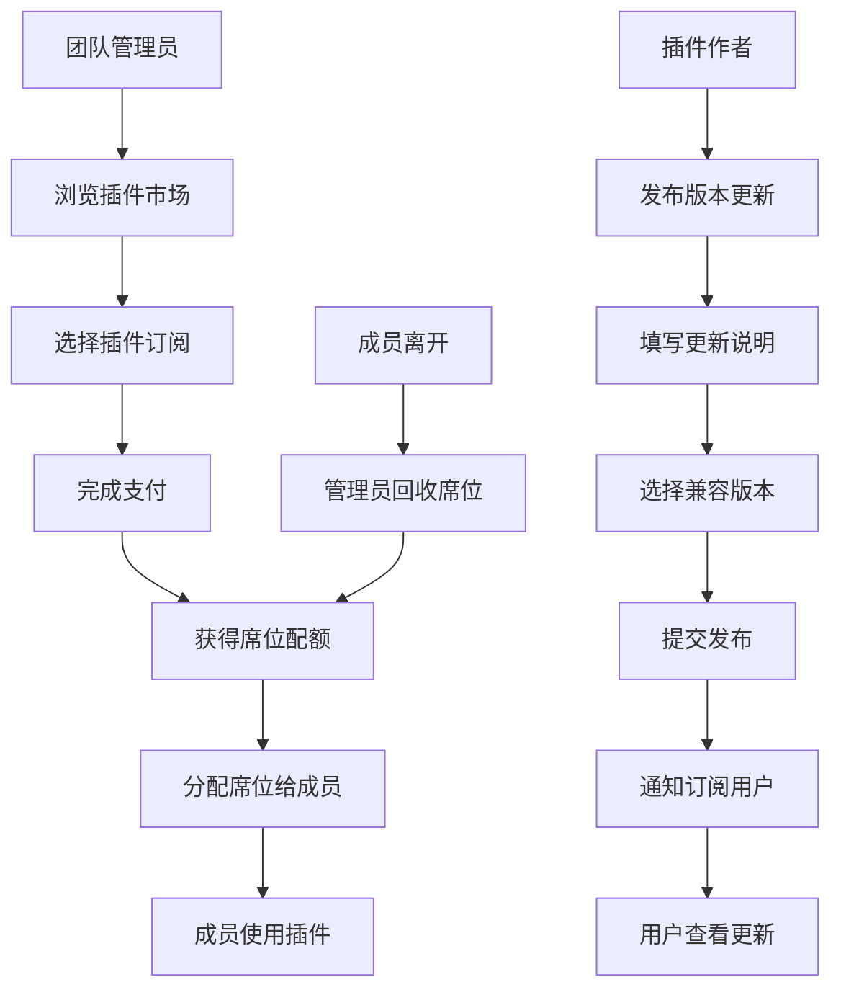

## 1. 产品概述

设计插件订阅后台是一个面向设计团队和插件作者的双角色订阅管理平台。团队可购买插件、分配席位、管理付款，作者可发布更新，实现安全高效的插件生态管理。

- 核心价值：为设计团队提供集中式插件订阅与席位管理，为插件作者提供安全的版本发布渠道
- 目标用户：设计团队管理员、团队成员、插件开发者/作者

## 2. 核心功能

### 2.1 用户角色

| 角色 | 注册方式 | 核心权限 |
|------|----------|----------|
| 团队管理员 | 邮箱注册/企业认证 | 购买插件、分配席位、管理成员、查看更新、管理付款 |
| 团队成员 | 管理员邀请 | 使用分配的插件、查看版本更新、更新个人信息 |
| 插件作者 | 开发者入驻申请 | 发布更新说明、管理兼容版本、查看订阅数据（不包含设计文件） |

### 2.2 功能模块

1. **仪表板**：订阅概览、席位使用统计、最近更新、付款提醒
2. **插件市场**：插件列表、插件详情、购买/订阅流程
3. **席位管理**：成员列表、席位分配、席位回收、使用状态
4. **版本更新**：更新日志、版本兼容、下载/安装引导
5. **付款管理**：付款方式、订阅记录、发票管理
6. **作者中心**：更新发布、版本管理、订阅数据看板

### 2.3 页面详情

| 页面名称 | 模块名称 | 功能描述 |
|----------|----------|----------|
| 仪表板 | 数据概览卡片 | 席位使用率、活跃插件数、最近更新、待处理事项 |
| 仪表板 | 时间线 | 版本更新时间线、团队活动记录 |
| 插件市场 | 插件列表 | 分类筛选、搜索、定价展示、订阅按钮 |
| 插件市场 | 插件详情 | 功能介绍、版本历史、用户评价、订阅选项 |
| 席位管理 | 成员列表 | 成员信息、已分配插件、席位状态、邀请新成员 |
| 席位管理 | 分配弹窗 | 选择成员、选择插件、有效期设置、确认分配 |
| 版本更新 | 更新列表 | 版本号、发布时间、更新内容、兼容状态 |
| 版本更新 | 详情视图 | 更新说明全文、兼容版本矩阵、升级引导 |
| 付款管理 | 付款方式 | 添加/编辑/删除付款卡、设置默认方式、安全提示 |
| 付款管理 | 订阅记录 | 订阅历史、费用明细、发票下载 |
| 作者中心 | 发布更新 | 版本号输入、更新说明编辑、兼容版本选择、发布 |
| 作者中心 | 数据看板 | 订阅数、活跃用户、版本分布图表（无设计文件访问） |

## 3. 核心流程

### 3.1 团队购买与分配流程
团队管理员浏览插件市场 → 选择插件并完成支付 → 系统分配对应数量席位 → 管理员进入席位管理 → 选择成员并分配席位 → 成员收到通知并可使用插件 → 成员离开项目 → 管理员回收席位 → 席位回归可用池

### 3.2 作者发布更新流程
插件作者登录作者中心 → 进入版本发布页面 → 填写版本号和更新说明 → 选择兼容的设计软件版本 → 提交发布 → 系统通知所有订阅用户 → 用户在版本更新页面查看更新

## 4. 用户界面设计

### 4.1 设计风格
- 主色调：深空蓝 (#0F172A) 搭配科技青 (#06B6D4)，体现专业与科技感
- 辅助色：翡翠绿 (#10B981) 表示成功/可用，琥珀橙 (#F59E0B) 表示警告，玫瑰红 (#F43F5E) 表示错误/禁用
- 按钮风格：微立体圆角按钮，悬停时有轻微上浮和发光效果
- 字体：显示字体使用 Space Grotesk，正文字体使用 Inter，等宽字体使用 JetBrains Mono
- 布局风格：侧边导航 + 主内容区的经典后台布局，卡片式模块，清晰的视觉层级
- 图标风格：线性简约图标，配合彩色状态指示点

### 4.2 页面设计概述

| 页面名称 | 模块名称 | UI Elements |
|----------|----------|-------------|
| 仪表板 | 数据概览 | 渐变数据卡片、环形进度图、悬停动效、淡入动画 |
| 仪表板 | 时间线 | 左侧时间轴、右侧内容卡片、状态色标、平滑滚动 |
| 插件市场 | 插件列表 | 网格布局、卡片悬停放大、价格标签、订阅按钮动效 |
| 插件市场 | 插件详情 | 大图展示、Tab 切换、版本折叠面板、CTA 固定按钮 |
| 席位管理 | 成员列表 | 表格布局、头像组、状态标签、批量操作工具栏 |
| 席位管理 | 分配弹窗 | 模态框、成员选择器、插件多选、日期选择器 |
| 版本更新 | 更新列表 | 时间线布局、版本标签、兼容徽章、展开详情动效 |
| 付款管理 | 付款方式 | 3D 卡片效果、翻转动效、CVV 安全提示、渐变卡面 |
| 作者中心 | 数据看板 | 折线图、柱状图、数据卡片、筛选器、无设计文件承诺提示 |

### 4.3 响应式
- 桌面端优先（1280px+），侧边导航固定展开
- 平板端（768px-1279px），侧边导航可折叠为图标模式
- 移动端（<768px），侧边导航变为底部 Tab 栏，表格转为卡片列表

### 4.4 动效设计
- 页面加载：元素从下往上淡入，错落延迟 50ms
- 卡片悬停：轻微上浮 (translateY(-4px)) + 阴影增强
- 按钮交互：点击时有缩放反馈 (scale(0.97))
- 模态框：背景模糊 + 弹性缩放进入
- 状态切换：平滑的颜色过渡和数字滚动动画
