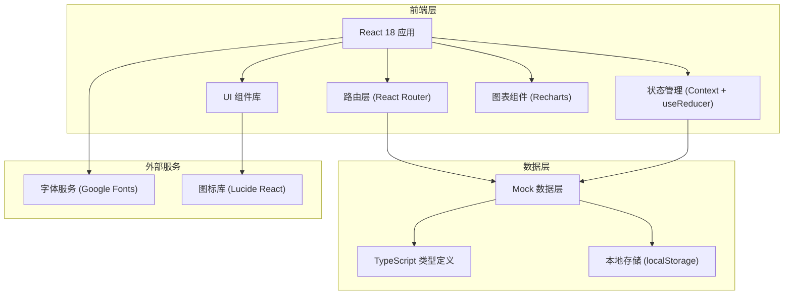
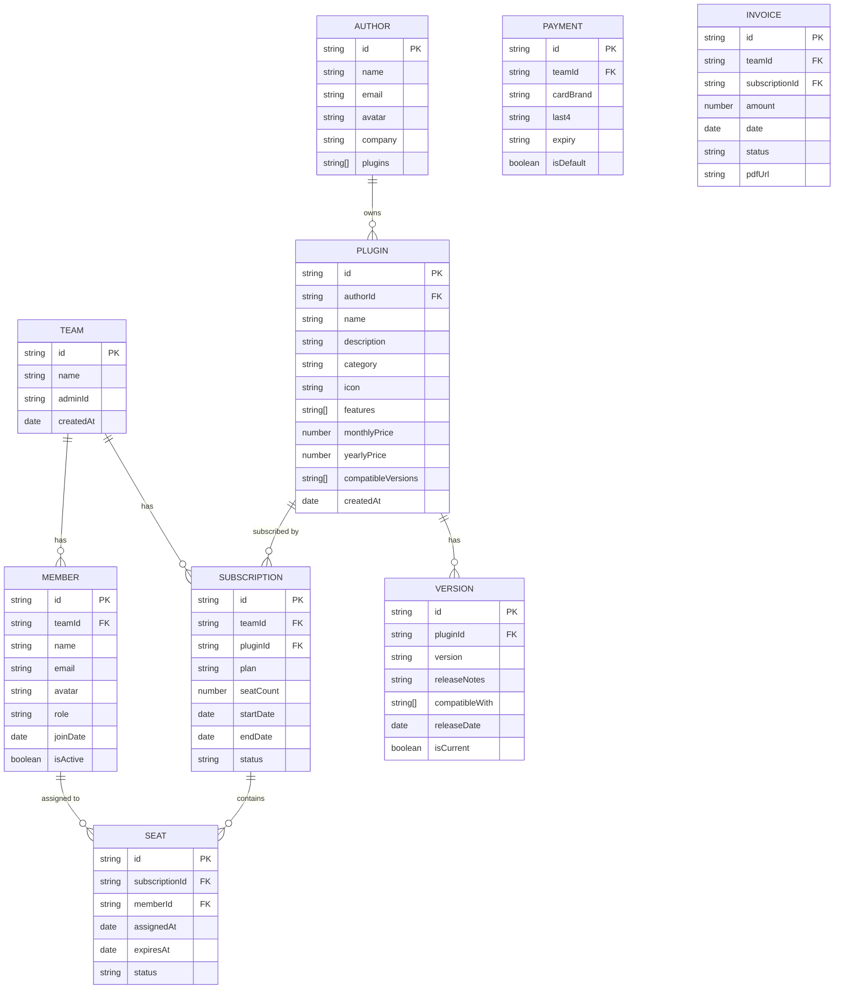

## 1. 架构设计



## 2. 技术描述

- 前端：React@18 + TypeScript + tailwindcss@3 + vite
- 初始化工具：pnpm create vite
- 后端：无后端，使用 Mock 数据模拟
- 数据库：使用 localStorage 进行数据持久化，mock 数据初始化
- 图表：Recharts
- 图标：Lucide React
- 状态管理：React Context + useReducer
- 路由：React Router DOM

## 3. 路由定义

| 路由 | 页面 | 访问权限 |
|------|------|----------|
| /login | 登录页 | 公开 |
| /dashboard | 仪表板 | 所有登录用户 |
| /marketplace | 插件市场 | 团队管理员/成员 |
| /marketplace/:id | 插件详情 | 团队管理员/成员 |
| /seats | 席位管理 | 团队管理员 |
| /updates | 版本更新 | 所有登录用户 |
| /payments | 付款管理 | 团队管理员 |
| /author | 作者中心 | 插件作者 |
| /author/publish | 发布更新 | 插件作者 |
| /profile | 个人设置 | 所有登录用户 |

## 4. 数据模型

### 4.1 数据模型定义



### 4.2 TypeScript 类型定义

```typescript
type UserRole = 'admin' | 'member' | 'author';

interface Team {
  id: string;
  name: string;
  adminId: string;
  createdAt: string;
}

interface Member {
  id: string;
  teamId: string;
  name: string;
  email: string;
  avatar: string;
  role: UserRole;
  joinDate: string;
  isActive: boolean;
  assignedSeats: string[];
}

interface Plugin {
  id: string;
  authorId: string;
  name: string;
  description: string;
  category: string;
  icon: string;
  coverImage: string;
  features: string[];
  monthlyPrice: number;
  yearlyPrice: number;
  compatibleVersions: string[];
  createdAt: string;
  rating: number;
  reviewCount: number;
  installCount: number;
}

interface Version {
  id: string;
  pluginId: string;
  version: string;
  releaseNotes: string;
  compatibleWith: string[];
  releaseDate: string;
  isCurrent: boolean;
  changes: {
    type: 'feature' | 'fix' | 'improvement' | 'breaking';
    description: string;
  }[];
}

interface Subscription {
  id: string;
  teamId: string;
  pluginId: string;
  plan: 'monthly' | 'yearly';
  seatCount: number;
  usedSeats: number;
  startDate: string;
  endDate: string;
  status: 'active' | 'cancelled' | 'expired';
  nextBillingDate: string;
  amount: number;
}

interface Seat {
  id: string;
  subscriptionId: string;
  pluginId: string;
  memberId: string | null;
  memberName?: string;
  memberEmail?: string;
  assignedAt: string | null;
  expiresAt: string | null;
  status: 'available' | 'assigned' | 'expired';
}

interface Author {
  id: string;
  name: string;
  email: string;
  avatar: string;
  company: string;
  website?: string;
  plugins: string[];
}

interface PaymentMethod {
  id: string;
  teamId: string;
  cardBrand: 'visa' | 'mastercard' | 'amex' | 'discover';
  last4: string;
  expiryMonth: number;
  expiryYear: number;
  isDefault: boolean;
  cardholderName: string;
}

interface Invoice {
  id: string;
  teamId: string;
  subscriptionId: string;
  pluginName: string;
  amount: number;
  currency: string;
  date: string;
  status: 'paid' | 'pending' | 'failed';
  pdfUrl: string;
}

interface Activity {
  id: string;
  teamId: string;
  type: 'seat_assigned' | 'seat_revoked' | 'version_released' | 'subscription_purchased' | 'member_joined' | 'member_left';
  description: string;
  timestamp: string;
  metadata?: Record<string, any>;
}
```

## 5. 目录结构

```
src/
├── assets/              # 静态资源
├── components/          # 公共组件
│   ├── layout/         # 布局组件
│   │   ├── Sidebar.tsx
│   │   ├── Header.tsx
│   │   └── PageContainer.tsx
│   ├── ui/             # 基础 UI 组件
│   │   ├── Button.tsx
│   │   ├── Card.tsx
│   │   ├── Modal.tsx
│   │   ├── Table.tsx
│   │   ├── Badge.tsx
│   │   ├── Input.tsx
│   │   ├── Select.tsx
│   │   └── Tabs.tsx
│   └── charts/         # 图表组件
│       ├── LineChart.tsx
│       ├── BarChart.tsx
│       └── DonutChart.tsx
├── context/            # 状态管理
│   ├── AuthContext.tsx
│   ├── TeamContext.tsx
│   └── PluginContext.tsx
├── data/               # Mock 数据
│   ├── mockPlugins.ts
│   ├── mockMembers.ts
│   ├── mockSubscriptions.ts
│   └── mockVersions.ts
├── hooks/              # 自定义 Hooks
│   ├── useAuth.ts
│   ├── useTeam.ts
│   └── usePlugins.ts
├── pages/              # 页面组件
│   ├── Login.tsx
│   ├── Dashboard.tsx
│   ├── Marketplace.tsx
│   ├── PluginDetail.tsx
│   ├── Seats.tsx
│   ├── Updates.tsx
│   ├── Payments.tsx
│   ├── AuthorCenter.tsx
│   ├── PublishUpdate.tsx
│   └── Profile.tsx
├── types/              # 类型定义
│   └── index.ts
├── utils/              # 工具函数
│   ├── formatters.ts
│   ├── validators.ts
│   └── storage.ts
├── App.tsx
├── main.tsx
└── index.css
```

## 6. 安全设计

### 6.1 权限隔离
- 路由级权限控制：未登录用户重定向至登录页
- 角色级权限控制：根据用户角色显示/隐藏功能模块
- 数据级权限控制：作者用户无法访问任何与设计文件相关的数据接口
- 敏感操作二次确认：席位回收、付款方式删除需二次确认

### 6.2 数据安全
- 付款信息脱敏显示：仅显示卡号后四位
- 本地数据加密：敏感信息使用 AES 加密存储
- XSS 防护：所有用户输入内容进行转义处理
- 无设计文件存储：系统不存储、不处理任何用户设计文件

### 6.3 作者隐私保护
- 作者看板仅显示聚合统计数据
- 不显示具体团队/用户的设计内容
- 数据图表仅展示数值分布，不包含用户标识
